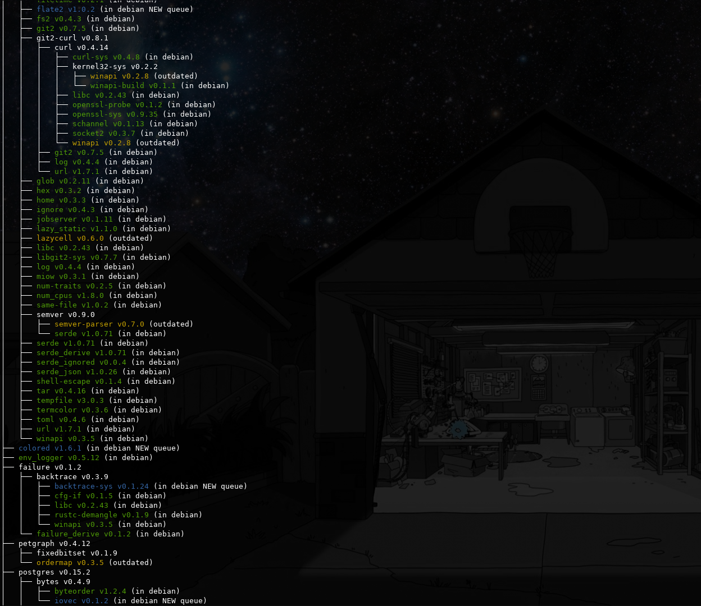

# cargo-debstatus

cargo-tree for debian packaging. Traverse all dependencies of a project, checks
if the dependency is already in debian, in the debian NEW queue or if it needs
to be updated.

The codebase is a modified version of [sfackler/cargo-tree].

[sfackler/cargo-tree]: https://github.com/sfackler/cargo-tree

## How to run

```shell
$ cargo install cargo-debstatus
$ cargo debstatus
```



## Known Bugs

- Some indirect optional dependencies are ignored

## License

This codebase is licensed:

```
(MIT OR Apache-2.0) AND GPL-3.0-or-later
```

due to it's use of cargo-tree code. The cargo-debstatus code is licensed
`GPL-3.0-or-later`. Terms of the GPL apply.
